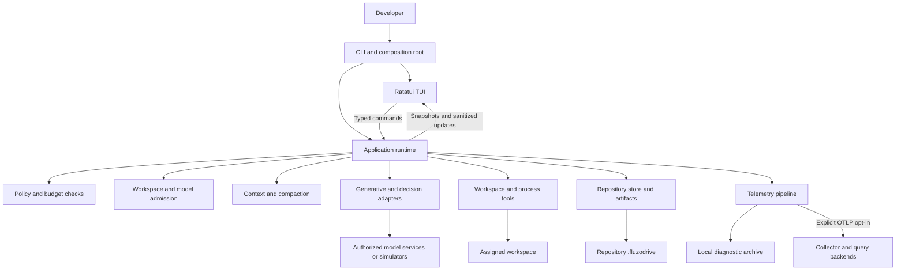
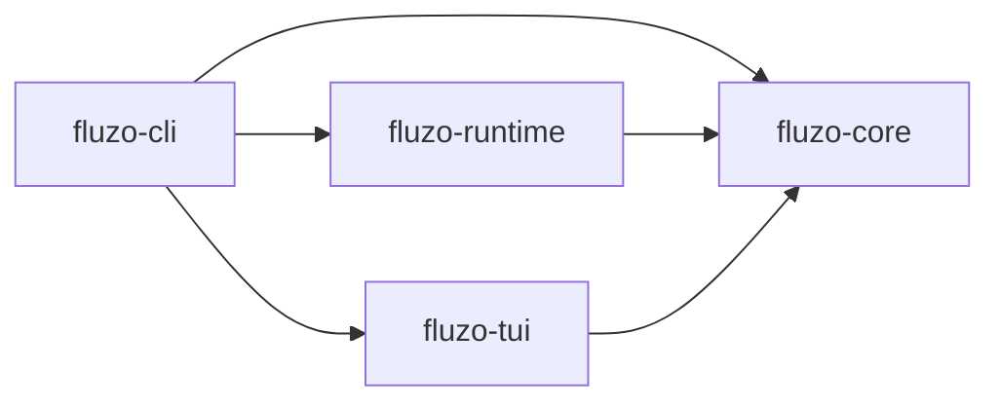
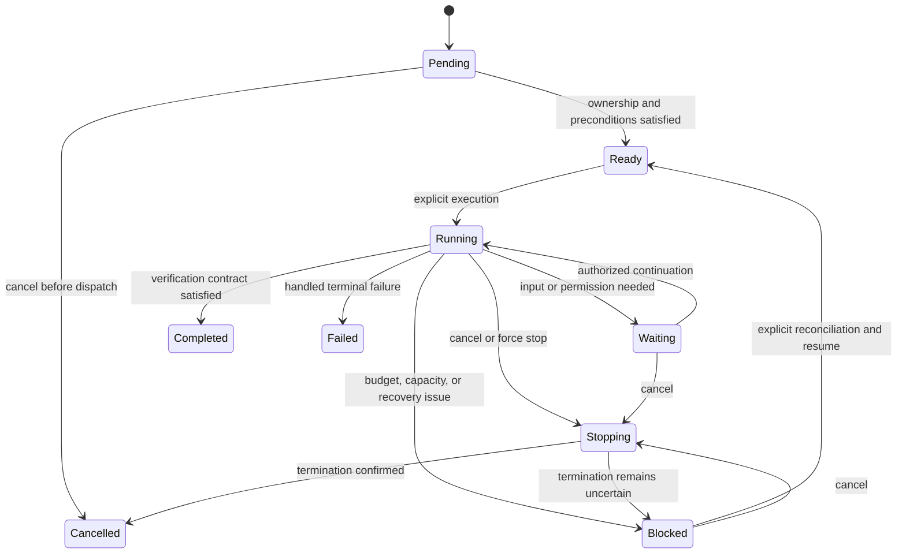
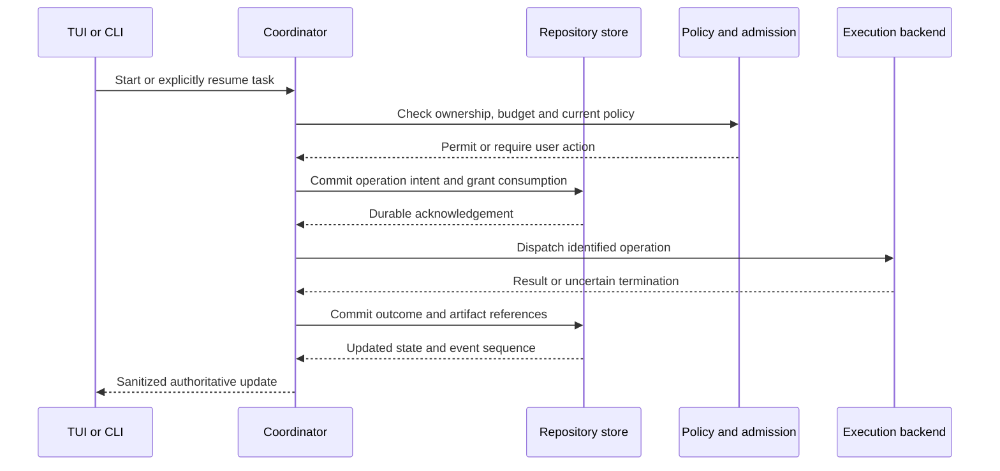

# Fluzo MVP Architecture

**Status:** Draft for refinement; not an implementation claim
**Version:** 0.1
**Date:** 2026-09-24
**Product baseline:** [PRD.md](PRD.md), version 0.2, MVP scope approved
**Target:** Linux x86_64, Arch Linux and CachyOS; Ghostty and Alacritty

## 1. Purpose and Authority

This document proposes how to implement the approved Fluzo MVP. The PRD defines product requirements and acceptance; this document defines component ownership, runtime flows, persistence boundaries, and implementation choices. A proposal here does not override the PRD. Any change to scope, security guarantees, defaults, or acceptance requires explicit product-owner review and a PRD revision.

The initial deliverable is a native single-agent application with a polished TUI, a headless CLI, repository-local state, optional Laya observation, and OpenTelemetry. It is not an ACP/MCP orchestrator, a distributed scheduler, or an OS sandbox. Those remain future capabilities. This draft does not select dependency versions, claim benchmarks have passed, or authorize contacting real model services.

## 2. Architecture Summary

Use a modular monolith with one composition root and an in-process application runtime. Keep business decisions in the runtime and domain layer, not in Ratatui widgets or provider adapters. The same runtime serves interactive and headless workflows.



The diagram describes responsibilities, not a requirement for a crate or process per box. Tool execution, provider I/O, storage, and rendering are asynchronous or isolated from the UI thread; they do not each become a microservice.

### 2.1 Non-Negotiable Invariants

| Invariant | Owning boundary |
| --------- | --------------- |
| One writing task per workspace, across local processes | Workspace ownership manager |
| A view, replay, or session open does not execute work | Runtime command handlers |
| Policy, current versions, budget, and ownership are checked before side effects | Execution coordinator |
| Intent is durable before dispatch; uncertain completion is not silently retried | Store and execution journal |
| Model and pool limits cover every inference path, including compaction and observations | Admission manager |
| Laya cannot authorize, route, execute tools, or consume reserved foreground slots | Observer and admission manager |
| No automatic HTTP redirects; no raw untrusted terminal controls | HTTP and display adapters |
| Native path confinement is not a claim that shell commands are sandboxed | Local execution backend |
| The project config is data, not evidence of authorization | Config and consent services |
| Only explicit resume starts a recovered attempt; YOLO does not survive recovery | Session coordinator |
| Required audit persistence cannot be replaced by best-effort telemetry | Repository store |
| Deterministic tests and packaging never require real inference | Test harness and composition root |

## 3. Accepted MVP Code Boundaries

Accepted A01 (2026-09-24): start with these four crates in one Cargo workspace. This is a modular monolith, not four services. Extract more crates only when implemented behavior demonstrates a useful dependency, ownership or testing boundary; do not create empty crates for roadmap features.

| Crate | Owns | Does not own |
| ----- | ---- | ------------ |
| `fluzo-core` | IDs, commands/events, task and operation states, config types/metadata, pure policy/budget rules, error taxonomy | Filesystem/network I/O, Ratatui, provider SDKs, SQLite connections |
| `fluzo-runtime` | Application services, coordinators, persistence and all external adapters | UI layout, key bindings, theme or frame state |
| `fluzo-tui` | Views, composer, focus, typed settings forms, notifications, animation, sanitized rendering | Execution policy, provider requests, direct session DB writes |
| `fluzo-cli` | Binary, argument parsing, startup, dependency wiring, command output and shutdown | Duplicate agent logic or a second policy implementation |

Dependency direction:



The CLI passes a transport-neutral application port to the TUI. The port exposes typed commands, read models, and subscriptions without exposing provider, process, DB, or mutable domain-state handles. Define shared protocol types and the port contract in core; concrete channels, transport adapters, and lifecycle management remain outside the TUI. Do not add an unrestricted generic command executor to make UI wiring convenient. The accepted extraction boundary and its tests are defined in section 5.4.

Suggested internal runtime modules are `application`, `config`, `sessions`, `execution`, `admission`, `context`, `providers`, `tools`, `storage`, `telemetry`, and `platform`. These are ordinary modules initially. Platform-specific functions live at the owning adapter boundary, not behind a speculative framework spanning all possible future platforms.

The crate graph above is an architectural constraint for production dependencies. Core must not depend on the other Fluzo crates or perform I/O; runtime and TUI depend on core, not each other; the CLI is the composition root. Transport implementations are selected there and exposed through the core application-port contract. Keep private implementation types and concrete storage/provider handles inside runtime so crate separation preserves accepted A02's extraction boundary rather than merely renaming tightly coupled code.

Implementation acceptance must check Cargo's resolved dependency graph, including supported production feature combinations, for forbidden edges and cycles. Core/domain tests must run without terminal, database or network services; runtime tests must not require a TUI; TUI tests use protocol fixtures without importing runtime business services. The end-to-end composition harness tests the integration separately. No dependency-graph or build test is claimed to have run while the workspace is still only design documents.

### 3.1 Initial Technology Proposals

| Area | Proposal and rationale |
| ---- | ---------------------- |
| Async I/O | Tokio with bounded channels and explicit cancellation ownership |
| Terminal | Ratatui and Crossterm; one terminal writer |
| CLI | Clap, sharing the core config/error model |
| Config | Serde types, schema metadata, and `toml_edit` for comment-preserving edits |
| HTTP | Reqwest with redirects disabled and explicit streaming/deadline handling |
| SQLite | `rusqlite` behind a dedicated serialized writer; bounded background readers |
| Git | Git CLI with explicit arguments and disabled implicit external helpers |
| Native Linux files/processes | Standard facilities plus a focused library such as `rustix` where handle-based confinement/signalling is needed |
| Observability | `tracing`, OpenTelemetry SDK and OTLP; explicit bridges for each supported signal |
| Tests | Rust tests, HTTP simulators, controllable clock, Ratatui buffers, and PTY harness |

Versions and exact SDK bridges require a compatibility spike. In particular, a trace bridge alone does not export metrics and logs. No choice in this table authorizes importing third-party source or artwork under incompatible terms; Fluzo's original code is MIT.

### 3.2 Modular Capabilities and Future Extensions

Accepted A10 (2026-09-24): keep selected capabilities independently enableable and implementations replaceable through narrow internal contracts, with a future extension system as an intended evolution. The MVP ships explicitly wired built-in modules/adapters, not a plugin installer, dynamic library loader, scripting engine, extension marketplace, or stable public SDK/ABI. A built-in optional component is an extension-ready boundary, not a claim that third-party packages can already be loaded.

Distinguish the following concepts rather than treating every behavior as a boolean feature flag:

| Concept | Meaning | Decision-system example |
| ------- | ------- | ----------------------- |
| Capability | Typed service role and its inputs/outputs | A decision provider evaluates a bounded state and candidate actions |
| Implementation | Concrete adapter satisfying that role | Built-in Laya System One adapter; another compatible implementation may be added later |
| Binding and configuration | Explicit selection, endpoint/model, schema and resource limits | Existing `decision.model` resolves a configured model with provider `laya_systemone` |
| Enablement | Whether new work may be sent to that optional capability | `decision.enabled`, edited through the normal TUI or the approved devmenu control |
| Runtime mode | How the runtime is allowed to use the result | `shadow` in the MVP; active decision use requires a later approved contract |

Implementation names must not leak into the task engine's control flow. A narrow internal `DecisionProvider` contract returns a typed recommendation or error; the Laya adapter translates its API into that contract. The runtime supplies a bounded snapshot with task/attempt identity, source-state version, question/schema version and allowed alternatives, and validates the result against those inputs. Confidence or recommendation data is not an instruction to execute arbitrary code, invoke tools, approve permissions, or declare verification successful. Provider-specific payloads remain in the adapter; domain/UI consumers use the common observation model.

#### Decision support is not plan execution

For the MVP, the native agent already carries out the user's task through the execution coordinator. Laya only produces optional observations; it does not select the next executable step. A future active decision capability could recommend the next permitted step of a plan, or a different implementation could provide a compatible recommendation. Planning strategy, decision-provider selection, and plan execution are separate responsibilities. The runtime remains responsible for dependency/state checks, workspace ownership, consent/policy, budgets, tools, audit and verification. It does not delegate these guarantees merely because a component is called an extension.

```text
MVP:
    runtime decision point -> selected decision provider -> observation/evaluation only
    native execution coordinator -> ordinary policy/budget/tool pipeline

Possible later active mode, requiring explicit product approval:
    plan state -> selected decision provider -> typed recommendation
    recommendation -> runtime validation and approval gates -> permitted next step
```

Scope alignment confirmed on 2026-09-24: active plan decision support is post-MVP, not a prerequisite for implementing the current release. PRD section 10.1 remains unchanged. The later design will determine whether an extension supplies recommendations, a planning strategy, or a separate orchestration capability, and validate its domain accuracy/fallback behavior; those details are intentionally deferred. Substituting a provider that answers a different kind of question requires a new/adapted capability contract, not returning arbitrary text through an unchanged interface. The MVP keeps `decision.mode = "shadow"`; enabling Laya or selecting another provider must never promote it to active mode silently.

#### Activation and lifecycle

The composition root selects from known built-in implementations. Use an explicit factory/registry only for roles the implementation actually needs, with stable internal identifiers, typed settings and declared dependencies; do not build a universal extension framework or create placeholder crates. A06 supplies configuration metadata/validation and A02's port exposes capability status to the TUI without leaking concrete provider objects.

Optional enablement and binding preferences are saved in the repository `.fluzo` under their existing typed sections. A missing/disabled Laya capability leaves ordinary native execution usable. If a future task explicitly requires an unavailable capability, return a clear blocked/unsupported result rather than silently selecting another provider or reporting success. Required policy, audit, consent, cancellation and admission safeguards are not optional capabilities that a devmenu flag can disable.

Disabling a capability stops new dispatches and removes its queued work; admitted work follows bounded cancellation/drain and uncertain-outcome accounting. Do not kill the remote service, free uncertain slots, reset budgets or transfer pending approvals to the replacement. Changing implementation/configuration applies to future work by default; switching active work requires explicit application at a safe boundary. Stateful implementations need a reviewed migration/resume contract, not an assumed hot-swap. Recorded results retain their original implementation/configuration identity so later analysis does not attribute old Laya observations to a replacement.

An enable switch is not an authorization grant. Endpoint/credential consent, input minimization, per-process model/pool admission, telemetry/redaction and the foreground reservation still apply. Inference performed by a built-in decision adapter goes through the provider gateway, not a private HTTP path that bypasses limits. Replacing a module must not introduce cross-instance capacity coordination, provider rate-limit management or automatic provider failover excluded by A04.

#### Later external-extension packaging

Potential later extension roles include decision providers, context sources, tools and execution backends, as their existing roadmap capabilities are implemented. Not every internal trait is a public plugin API. Packaging/loading, interface-version negotiation, capability manifests, enable/disable UX, dependency resolution, state migration and trust/isolation require a separate reviewed design before external extensions are supported. ACP and MCP are interoperability adapters, not automatically a general plugin runtime. No Rust ABI, WASM host, subprocess protocol or hot-reload mechanism is selected by A10.

An in-process trait boundary does not sandbox untrusted extension code. Future distribution must decide whether extensions are trusted code or use an enforceable isolation boundary, and state the resulting guarantees. Extensibility must preserve the runtime's validated execution path rather than offer arbitrary callbacks with mutable global state, raw DB handles or credential access. Reuse the accepted UI/runtime port when exposing capabilities instead of requiring TUI changes for every provider implementation.

Implementation checks must demonstrate disabled Laya causes no decision-provider dispatch, malformed or stale recommendations never execute actions, and a contract-test substitute can replace the Laya implementation without changing coordinator/UI code. Keep HTTP-boundary tests for the real Laya adapter alongside the fake provider; this is not a substitute for A08 acceptance. Exercise enable/disable/drain, failed dependency resolution, denied destination consent, preserved limits, source identity on retained observations, and no automatic promotion from shadow mode. These checks demonstrate the internal boundary; they do not claim public plugin compatibility or implemented extension loading.

## 4. Decision Register

These are implementation decisions within the approved PRD, not additional product scope. A01 was accepted on 2026-09-24: a modular monolith with four initial crates and the dependency direction in section 3. A02 was accepted on the same date: embed the runtime for the MVP, keep an explicit extraction boundary, and treat an independent service as a possible future option rather than a committed delivery. A03 was accepted: repository-local SQLite with one writer, WAL and `synchronous=FULL`, transactional state/audit records, durable intent before side effects, separate artifacts, batched streaming checkpoints, and recoverable migrations. A04 was accepted with an explicit scope correction: only per-process model/pool admission; no cross-instance inference coordination or provider rate-limit management, now or on the current roadmap. A05 was accepted on 2026-09-24: strict native workspace confinement, direct executable/argument requests by default, explicit shell mode, closed stdin, reviewed environments and owned-process lifecycle management, without an OS sandbox claim. A06 was accepted on the same date: one typed settings definition in core, shared by file validation, runtime and TUI, with distinct save/apply actions. A07 was accepted on the same date: versioned snapshots and bounded updates, durable decisions separated from coalescible presentation, and responsive viewport-bounded rendering as a defining product quality. A08 was accepted on the same date: harness-owned Rust HTTP simulators, versioned deterministic scenarios, real native execution in disposable fixtures, and isolated deterministic/Compose/opt-in live profiles. A09 was accepted on the same date: required SQLite audit separate from versioned local JSONL diagnostics and optional OTLP HTTP/protobuf export, independently bounded non-blocking diagnostic pipelines, and the revision-pinned GenAI conventions in section 13.3. A10 was accepted on the same date: optional built-in capabilities and replaceable internal adapters, designed for a future extension system without an MVP loader or stable public plugin API. All ten architectural decisions are accepted within the existing MVP scope. Active Laya plan control is confirmed as post-MVP in section 3.2 and does not block current implementation.

| ID | Status | Decision | Tradeoff / review focus |
| -- | ------ | -------- | ----------------------- |
| A01 | Accepted | Modular monolith with `fluzo-core`, `fluzo-runtime`, `fluzo-tui`, and `fluzo-cli`; runtime/TUI depend on core, CLI composes both | Keep runtime features as modules initially; enforce dependency direction without creating empty future crates |
| A02 | Accepted | TUI and runtime share the owning process; one active runtime owner per workspace, behind a transport-neutral application port | Owner exit initiates bounded task shutdown; service extraction remains possible without being implemented in the MVP |
| A03 | Accepted | One repository-local SQLite writer, WAL and `synchronous=FULL`; state/audit committed together, durable intent before effects, separate artifacts and batched streaming | Measure critical-write latency off the UI loop; external effects remain non-transactional and interrupted outcomes may be unknown |
| A04 | Accepted | Independent per-process model/pool concurrency limits; no inference-capacity coordination between instances or external rate-limit management | Multiple instances may oversubscribe a server; allocation across clients is the user's responsibility, and provider rejections are reported without automatic rate-limit recovery |
| A05 | Accepted | Root-relative native file tools; direct executable/arguments by default, explicitly selected shell, closed stdin, reviewed environments and owned process groups | Fail closed on unprovable native containment; arbitrary programs remain unsandboxed and uncertain termination stays visible |
| A06 | Accepted | Typed Rust settings and shared metadata/defaults/validation in `fluzo-core`; runtime revalidates and owns save/apply, TUI renders typed controls | Separate persisted future values from active settings; no generic form framework or duplicated validation rules |
| A07 | Accepted | Versioned snapshots and bounded, sanitized updates; prioritize input/control, coalesce visual work, and render visible content independently of runtime events | Perceived speed is a product priority; profile latency, allocations and terminal output without weakening persistence, safety or truthful status |
| A08 | Accepted | Harness-owned loopback HTTP simulators and deterministic versioned scenarios exercise the real runtime and tools in disposable repositories | Required CI is inference-independent; unexpected or missing requests fail; demos, Compose integration and optional live results remain distinct |
| A09 | Accepted | Durable audit, local versioned JSONL diagnostics and opt-in OTLP HTTP/protobuf are separate paths; bounded asynchronous sinks and pinned GenAI spans/metrics | Diagnostic loss is visible, not a runtime blocker; protect input latency, capture privacy and single-source token accounting |
| A10 | Accepted | Enableable built-in capabilities with replaceable typed implementations; prepare future extensions without an MVP plugin loader or public API commitment | Laya implements decision observation, not plan execution; activation, substitution and runtime authority stay separate, with active decision use requiring later approval |

## 5. Process Topology and Ownership

### 5.1 Startup Modes

The composition root selects a mode before constructing adapters:

| Mode | Runtime and connectivity |
| ---- | ------------------------ |
| Interactive | TUI plus a local runtime; no model request merely from opening the app |
| Headless execution | The same runtime with structured CLI input/output and non-interactive approval rules |
| Inspection | Read-only projections or recorded history; no new execution attempt |
| Demo / deterministic test | Isolated configuration, synthetic fixtures, and simulator-only dependencies; never fall back to live providers |

Missing configuration opens the interactive wizard or returns `configuration_required` headlessly. Parsing configuration does not authorize an endpoint, load a remote model, or probe connectivity. A valid file with an offline provider still opens its session/settings views.

Under accepted decision A02, the interactive owner runs the TUI and runtime in the same OS process as separate components. Headless execution hosts the same runtime without Ratatui. There is one active runtime owner per workspace; it can manage multiple task records but admits at most one writing task. History readers and explicit inspection/cancel/kill clients may coexist. Starting a second independent execution runtime is refused with an owner diagnostic rather than silently creating another scheduler. Secondary clients do not own the runtime lifetime.

The MVP does not spawn a daemon, install a service, or continue background tasks after the owning application exits. The CLI composition root responds to owner exit by initiating bounded task shutdown, retaining durable outcomes and explicit uncertainty. Closing an inspection client only detaches that client. A crash does not guarantee remote inference or descendants stopped; explicit recovery starts a new attempt only after reconciliation. Extracting the runtime into an independently managed service is a possible future option under section 5.4, not an approved background-execution feature or automatic failover policy.

### 5.2 Ownership and Local Control

Resolve workspace identity from the actual working-tree root and filesystem identity, not the directory name, configured project label, or caller's startup directory. Acquire ownership before establishing a mutation baseline. Keep ownership across related edits, commands, verification, and approval waits; only release at a durable quiescent boundary with no uncertain writer.

Propose OS-backed advisory locks plus durable owner/journal metadata. A PID alone is not an ownership credential. Kernel lock release after a crash does not establish that descendants or remote inference stopped. Recovery inspects the journal and presents unresolved work before admitting a new writer.

The owner exposes a private Unix-domain control socket for task inspection/cancel/kill commands. Keep sockets and process coordination in owner-only user-local runtime state, with a secure fallback when the platform runtime directory is unavailable. Verify socket ownership/permissions, peer UID, owner instance identity, and protocol version. This is not a TCP service, a generic remote API, or protection against a malicious process with the same OS-user authority.

Use typed messages with request IDs and explicit task IDs. Repeated cancellation is idempotent. A repeated request to start work must not accidentally create two tasks. An uncertain reply to a mutating control request is queried/reconciled by its request ID, not blindly resubmitted. Read-only commands never acquire permission to start a task.

The local control socket is an adapter for the permitted subset of the same application protocol, not a second command handler or agent engine. Its clients cannot request unrestricted execution or runtime shutdown merely because the shared protocol contains lifecycle-related types. Authority comes from the verified connection context and permitted command set, not a client-supplied owner flag. This limited socket does not require a second full interactive TUI client or a general remote API in the MVP.

### 5.3 Execution Ownership Is Not Model Capacity

Workspace ownership and runtime ownership protect a working tree. Model/pool admission only limits requests originated by this runtime process. Accepted A04 does not establish ownership of a model server, a shared serving-slot reservation, or a machine-wide quota. Read-only history requires no inference capacity. A future worktree runtime or a Fluzo instance in another repository has independent counters even if it targets the same server.

Each process loads its model and pool limits from the selected repository's `.fluzo`. A pool represents the user's grouping of resources for this process only; it has no cross-process identity, lock file, coordinator, peer discovery, global counter, or exclusive lease. Two instances configured for two requests each may issue four requests in total. That is an explicit supported limitation, not a failure of Fluzo's per-process ceiling. Aggregate allocation across Fluzo instances, other programs, hosts, and providers is the user's responsibility.

Within one runtime, all request paths still share the configured model/pool counters, bounded queues, foreground reservations and local uncertainty handling. Aliases explicitly configured for the same model share its capacity identity inside that runtime, not across repositories. Endpoint approval and redirect protection remain security checks, not capacity-discovery mechanisms. Fluzo does not infer physical GPU topology or free server slots.

Provider rate-limit management is excluded from the MVP and the current roadmap: no adaptive quotas, token buckets based on remote limits, provider-specific cooldowns, automatic `Retry-After` waits, cross-instance arbitration, or failover to another provider. HTTP 429 and recognized capacity/quota rejections become sanitized, observable failures; they are not automatically retried. Existing bounded retries for other safely classified transient errors are a separate local request policy, not a capacity guarantee. A02's one-writer/owner contract for the same workspace remains unchanged.

### 5.4 Accepted Extraction Boundary; Optional Future Service

The accepted design prepares B without building B. Extraction should replace the application transport and hosting/lifecycle adapter, not duplicate the task engine, policies, provider gateway, persistence, or UI workflow. It is not a promise that service packaging and distributed failure handling will require no work.

#### MVP boundary

* **Application port:** the TUI and headless presentation use typed command, query, and subscription operations. The embedded adapter uses bounded in-process messaging internally. UI code does not import concrete runtime modules or receive Tokio channel handles, cancellation tokens, DB connections, shared mutable domain objects, or provider clients as its application API.
* **Owned protocol data:** requests/results/events use owned, serializable values with stable IDs, request IDs, protocol/schema versions, state versions, and pagination/subscription cursors where applicable. No closures, borrowed process-local references, file descriptors, render widgets, or absolute deadline instants cross this boundary. Relative durations and informational timestamps are data; the runtime remains authoritative for deadline accounting.
* **One authority:** workspace ownership, per-process inference admission, credentials, consent, effective config, task state and artifact resolution belong to the runtime services. Clients request config changes or artifact pages; they cannot mutate the DB or read private artifacts by bypassing those services. UI-side config validation may provide feedback, but the runtime revalidates every write and authorization decision. Credentials are resolved internally, never returned in generic snapshots.
* **Independent lifetime:** a runtime host exposes explicit startup, quiesce and bounded shutdown operations to the composition root, independent of the application port's client attachments. The domain engine never calls terminal exit APIs, depends on widget destruction, or assumes a dropped subscription is task cancellation. The MVP owner-exit policy explicitly invokes shutdown; detaching another client does not.
* **Presentation state stays local:** focus, scroll, draft composition, menus, themes and animation remain client state. Permission requests, queued interventions, failures and task outcomes are runtime state. The backend requests an action through a typed event, not through a callback that opens a Ratatui dialog or reads the terminal directly.
* **Transport failures are explicit:** acknowledgement is not completion. Requests with unknown acknowledgement are queried by request ID before retry; stale approvals are rejected by operation/version. Bounded event delivery exposes sequence gaps, allowing snapshot/page recovery. Dropping a slow client cannot block cancellation, lose a mandatory audit record, or grant consent.

The concrete async port signature, codec, and wire-version handshake remain implementation details to validate, not stable public plugin APIs. Serialization need not be paid on every in-process call; test the data contract without adding a loopback HTTP or RPC hop to the normal embedded path. Keep transport-specific dependencies in adapters, not in core protocol payloads or runtime business services.

#### Extraction plan if B is approved later

```text
MVP:        TUI / headless presentation -> embedded port -> runtime host
            one owning process; separate UI, protocol and runtime components

Possible B: TUI / headless presentation -> service client transport
                                         -> service application adapter
                                         -> same runtime host and services
```

1. Add a service composition root that hosts the existing runtime library. Move ownership of the runtime lifetime from the interactive CLI root to this host; keep repository state and audit recovery in the same services.
2. Add a client transport and service dispatcher implementing the application port and protocol. The existing private socket supplies an initial inspection/control adapter, but does not yet implement every service operation or a multi-client security model.
3. Change dependency wiring so presentation gets the service client instead of the embedded client. Keep view reducers, typed commands/read models, tool adapters, admission and persistence logic unchanged except for explicitly versioned protocol evolution.
4. Separately review detach/continue behavior, unattended permission waits, session YOLO lifetime, service shutdown/update/restart, authentication, client authority, quotas and reconnection. Changing owner exit to leave tasks running changes the approved MVP lifecycle and requires explicit product approval. Reconnecting a view must never resume an interrupted task implicitly.
5. Validate both adapters with the same application contract suite plus service-only disconnect, version-skew, takeover and restart cases. Multi-host service operation, remote workspace paths, secret distribution and a shared inference scheduler are further designs, not consequences of moving a process.

No daemon executable, service installation, network listener, remote credentials flow, generalized RPC framework, or extra service crate is required now. This extraction plan does not broaden accepted A04: moving the runtime to a service would not automatically introduce cross-instance inference coordination or provider rate-limit management, neither of which is on the current roadmap.

#### Tests that keep extraction practical

The MVP implementation must demonstrate a headless runtime test with no Ratatui/terminal dependency; a TUI build/test that depends on the shared port contract rather than `fluzo-runtime`; serialization round trips for public DTOs; and a shared command/query/subscription contract suite reusable by adapters. Exercise the existing socket's supported subset against those same handlers, not duplicate implementations.

Lifecycle tests distinguish detaching a reader from closing the owning application, and confirm that owner shutdown preserves partial edits/unknown results without killing independently managed services. Include duplicate command IDs, unknown acknowledgements, stale approval versions, sequence gaps, slow subscribers, and reconnecting for inspection only. Architectural dependency checks belong in CI; a design diagram alone cannot prevent a future UI shortcut around the port.

## 6. Domain and Application Protocol

### 6.1 Core Records

| Record | Responsibility |
| ------ | -------------- |
| Project / workspace | Stable identity, resolved root, strategy, protected paths and owner |
| Session | Conversation association, selected task, retained history and transient mode |
| Task | User goal, task state, configured budget, workspace and verification contract |
| Attempt | Explicit execution/resume interval, trace identity, config snapshot and outcome |
| Operation | Typed requested action, input/source versions, approvals, durable dispatch intent and result |
| Provider request | Model/pool identity, usage reservation, attempt number and capacity disposition |
| Permission grant | Scope, issuer, expiry, consumption and revocation; never reconstructed from prose |
| Artifact | Private relative identifier, ownership, content version/digest, redaction/truncation metadata |
| Observation | Laya input references, typed recommendation, actual-action link and optional later label |

Keep task, attempt, operation, and provider-request states distinct. A task can be blocked because an interrupted operation has an unknown result. That does not turn the operation into a failure or make a retry safe. YOLO is an explicit transient session setting, not a stored permission default.

### 6.2 Commands and Views

The application protocol includes commands such as `StartTask`, `QueueIntervention`, `ApproveOperation`, `RevokeGrant`, `ResumeTask`, `CancelTask`, `ForceStopTask`, `SaveConfig`, `ApplyConfigToActiveWork`, and `PurgeHistory`. Inputs carry expected versions where stale decisions matter and follow the owned, versioned DTO boundary in section 5.4. These are UI/CLI commands, not tools exposed to the coding model. Transport adapters select an authorized command subset and invoke the same application handlers; no transport owns its own execution logic.

Read queries include task lists, task detail, event pages, diff/artifact pages, effective settings, and capacity/telemetry health. Opening a detail view cannot call an execution command as a side effect. Task selection and composer destination are explicit and independent of which task currently owns the workspace.

An application handle returns command acknowledgement plus later state updates. UI acknowledgement means the request was accepted for processing, not that a tool succeeded. Persisted versions and correlation IDs let the client query the authoritative outcome after a disconnect.



This diagram is a task-level sketch; transition guards belong in tested domain code. Attempt interruption and per-operation `unknown` outcomes are separate records. Completed/cancelled tasks do not automatically re-enter execution merely because their conversation is opened.

### 6.3 Durable Events Versus Live Updates

Use two explicitly different update paths:

* Durable domain events: accepted task transitions, operation intents/results, permissions, configuration application, reconciliation and verification. Assign ordered per-run sequence numbers and commit before publishing a corresponding authoritative state change.
* Live presentation updates: token deltas, provisional streaming text, progress and render/queue health. They may be coalesced and have bounded buffering. They cannot replace audit events or claim uncommitted success.

An event envelope contains a schema version, event ID, project/session/task/attempt IDs as applicable, sequence, wall-clock timestamp, correlation/causation IDs, and trace/span references. Use monotonic clocks for elapsed time and deadlines; wall-clock changes must not extend a budget.

Read models are snapshots with sequence/version cursors. On a gap or reconnect, obtain a fresh snapshot and retained event pages; do not depend on an unbounded broadcast backlog. Stream content is checkpointed in bounded batches and finalized durably; a crash may leave an explicitly incomplete message rather than invented missing output.

Accepted A07 requires a consistent snapshot/subscription handoff: the snapshot names its committed-event cursor and relevant projection versions, and subsequent delivery starts after that cut without a lost-update window. Use an atomic subscription handoff or cursor-based bounded catch-up. If the required range is no longer available, return an explicit resynchronization response and obtain a new snapshot. Opening a view or repairing its subscription never starts or resumes task execution.

Coalescing may concatenate contiguous text ranges, replace superseded progress values, or replace queued deltas with a versioned bounded projection update. It must not discard arbitrary token fragments or treat an intermediate permission/outcome as if it never existed. Stream updates identify message/revision and offsets separately from the committed-event cursor; gaps request bounded content pages or a fresh projection. Keep retained text in the runtime/store, not in an unbounded per-subscriber queue. The uncommitted-tail loss on a crash remains the explicit A03 limitation, not a license for silent content loss during visual throttling.

Bound subscription queues by both record count and payload bytes. A slow subscriber can be marked lagging and resynchronized rather than hold up execution or mandatory audit commits. Persisted transitions and current pending approvals/errors remain inspectable even if intermediate frames were never painted. Tag asynchronous view/page requests with task identity, revision and view generation so a late result cannot overwrite a newer task selection, draft or scroll position. Duplicate or stale deliveries are rejected by version, not reapplied as new activity.

## 7. Execution and Failure Flows

### 7.1 Native Task Turn

The coordinator owns the workflow; a provider returns data, never directly invokes a tool. The sequence is:

1. Validate the task/config/trust context and acquire workspace ownership when the task may write.
2. Persist the attempt, effective configuration and baseline references.
3. Build bounded context; compact through the same provider gateway when necessary.
4. Reserve task budget and obtain model/pool admission without holding a DB transaction open.
5. Send an approved request, process bounded streaming data, and record completion/usage/capacity disposition.
6. Assemble and validate complete tool calls. Reject malformed schemas or unavailable tools; never execute fragments.
7. Evaluate the proposed operation against current permissions, workspace versions, limits and cancellation state.
8. Obtain any required normal-mode approval; recheck the approved scope immediately before dispatch.
9. Commit operation intent and one-time grant consumption, then perform the operation through the backend.
10. Persist the outcome and artifact references. Feed the typed result into the next logical turn or stop with a recorded reason.



Do not hold a SQL transaction while waiting for a human, model, semaphore, or process. A crash between dispatch and outcome persistence is explicitly possible. A successful shell exit followed by failed persistence is not evidence that retrying the command is safe.

### 7.2 Permissions and Tools

Accepted A05 separates confined native tool APIs from explicitly authorized local process execution. Pure policy evaluation produces `Allow`, `Deny`, or `AskUser` with typed reasons and scope. Only the runtime resolves approval state. Normal grants, current denials, one-time consumption and YOLO provenance are persisted. Changed file versions or environment/command scope invalidate stale approvals. Workspace ownership, current versions, policy and budget checks precede A03's durable intent acknowledgement and side-effect dispatch.

Tool adapters expose narrow typed requests: bounded file read/search, edit with expected version, structured Git inspection/approved mutations, and process execution. Avoid a generic file/path escape hatch. Protect Git metadata, project configuration, private data, and user credential paths according to the PRD.

Native file operations use root-relative handles and containment checks at the operation boundary, including new-file parent resolution, symlink/magic-link escape prevention, special-file rejection and protected-path checks after resolution. The Linux implementation spike will evaluate `openat2` or an equivalent race-aware facility through a focused binding such as `rustix`; exact flags, library versions and supported-kernel behavior remain to validate. Reject writes to multiply linked files in the MVP rather than introduce an unverified copy-on-write exception. If a required guarantee is unavailable, fail closed rather than falling back to a path-prefix check or canonicalize-then-open sequence. Rejected native operations do not automatically become shell commands. This does not exclude concurrent edits by another same-user program.

The default process request is a structured executable plus argument vector, with explicit working directory and reviewed environment. The runtime never implicitly joins arguments into a shell command. Pipelines, redirection or shell builtins require an explicitly selected shell request with its executable/mode and script included in the approval scope. A direct-spawn failure must not trigger fallback to `sh -c` or another interpreter. Resolve the executable against the approved environment/search path; reject an implicit current-directory search expansion. Shell startup profiles and command-injecting environment variables are not silently inherited.

Process execution uses closed stdin, captured/drained stdout and stderr, an explicit environment and verified process-group ownership, with no controlling terminal inherited from the TUI. Build the child environment from the documented baseline plus authorized injections, not a copy of all parent variables. Provider/telemetry secrets and authentication sockets are excluded by default; tool-specific secret injection follows separate approved references. Capture and model-context limits are distinct; after truncation, continue bounded draining rather than deadlocking a child on a full pipe. Git inspection suppresses implicit executable helpers and prompting. Interactive PTYs are not an MVP tool feature.

Direct execution reduces implicit interpretation but does not sandbox the program. Both direct processes and explicit shells can access OS resources outside the native tool API, including files and network, subject to their OS-user authority. Display that boundary and retain the future sandbox evaluation separately. Graceful cancellation and force stop act only on verified owned processes/groups; descendants that escape verifiable ownership or requests whose remote completion is unknown remain reported as uncertain under section 7.3.

Run blocking I/O, process startup/waiting and substantial search/formatting away from the TUI input path. Use bounded workers and buffers; check the affected paths/versions instead of rescanning the entire repository for every operation. Reuse validated root handles where safe, but do not cache away per-operation authorization or stale-version checks. A07's responsiveness targets do not justify weakening containment or the pre-dispatch journal.

Implementation acceptance includes traversal, internal/external symlinks, magic links, path-replacement races, nonexistent targets, hard-link writes and protected-path aliases. Process fixtures verify exact argument delivery without shell expansion, explicit shell behavior, no interpreter fallback after a failed spawn, EOF on stdin, absence of an inherited controlling terminal, authorized environment injection, and a sentinel provider credential absent from the child. Exercise output beyond capture limits, a cooperative child, a child ignoring graceful termination, descendants, and rejection of unrelated-process kill attempts. These are required tests to implement; accepting A05 does not claim that confinement or process ownership has already been proven.

### 7.3 Cancel, Kill and Recovery

Give cancellation/control messages a bounded priority path separate from output/event traffic. Cancelling queued work removes it before dispatch. For active work, persist control intent, stop new actions, cancel provider requests best-effort and request graceful process-group termination. Force stop requires the explicit task-scoped confirmation and ownership checks from the PRD.

Retain applied changes and captured output. A deadline is not proof of process death. Unknown process ownership or remote completion preserves the relevant workspace/capacity uncertainty; it must not release resources optimistically. Fluzo never kills an independently managed model server or collector as a task-control shortcut.

On restart, load recorded state without contacting providers. Mark unterminated attempts interrupted and reconcile workspace versions, processes and capacity records. Reopening history is read-only. Explicit resume creates a new attempt/trace linked to the original task, carries known budget consumption, drops transient grants/YOLO, and dispatches only newly authorized work.

## 8. Provider Gateway and Resource Admission

### 8.1 One Route to Inference

All model access uses an internal `ProviderGateway`: agent turns, compaction, Laya, authorized probes and live tests. No UI widget, observer callback, or helper constructs an independent HTTP client to bypass it. The gateway resolves the logical model, authorized endpoint, credential reference, capacity identity, policy/deadlines and request purpose.

Implement separate protocol adapters for OpenAI-compatible Chat Completions and Laya System One. Generative streaming assembles chunks by tool-call index/ID, bounds argument/message growth, handles usage-only chunks, and requires complete validated calls before returning executable proposals. Provider-specific reasoning fields are not automatically shown, stored as ordinary diagnostics, or treated as instructions.

The MVP uses the configured generative endpoint and optional Laya observation service, not a broker across multiple generative providers. Keep adapters replaceable for future integrations without adding load balancing, rate-limit scheduling or automatic provider failover. The gateway name describes local request ownership, not responsibility for the external server's aggregate load.

The Laya adapter validates typed `choice`, `noul`, and `score` outputs and translates them into the provider-neutral decision contract in section 3.2. The runtime records observations against immutable decision-point references; the task engine does not branch on the Laya implementation name. Recommendations and subsequent labels never become permission grants or executable plan steps in the MVP. Its devmenu control routes through the same settings/consent service as the normal configuration screen, with enablement distinct from runtime mode and implementation selection.

### 8.2 Atomic Admission

Use one in-process admission actor for budget reservations, per-model counts, pool counts, foreground FIFO queues and shadow allowances. Avoid independently acquiring a model semaphore and then waiting on a pool semaphore, which can deadlock or strand permits. A request receives a single admission record identifying every resource it reserves.

Admission evaluates the PRD's configured limits, not duplicated constants. Foreground requests wait only in the bounded queue until their deadline. A shadow request is admitted only with no queued foreground demand, available model/total-pool capacity, and room under `max_in_flight - foreground_reserved_slots`, counting uncertain shadow requests. Under the one-slot default, the observer records a capacity skip.

Capacity records distinguish reserved-not-dispatched, dispatched, confirmed-complete, cancelled-before-dispatch, and uncertain. A dropped task/future must not use an unconditional RAII permit release after network dispatch. Cancellation before dispatch can release the reservation; after dispatch, release requires adapter-specific completion evidence or explicit reconciliation. Usage uncertainty and capacity uncertainty are related but distinct: a completed response may lack token accounting without still occupying a serving slot.

Model/pool identity changes require revalidation and a safe boundary, not an accounting reset. A lower limit drains this runtime's existing requests. A higher active ceiling requires explicit application by the user. The repository's attempt journal retains unresolved requests for explicit recovery of that work; it is not a same-host pool-owner journal and cannot reserve capacity against another runtime. New independent instances never consult peers or another repository's request journal to acquire inference slots. Operator responsibility for combined load is explicit.

### 8.3 Errors and Budgets

Use a structured error taxonomy that includes permission/configuration requirements, budget exhaustion, capacity wait/full errors, provider authentication/rate limit/transient errors, protocol errors, redirect rejection, interrupted/unknown outcomes, and persistence failures. Carry sanitized detail and retryability evidence, not just a display string.

Reporting a rate-limit error is not rate-limit management. HTTP 429 and recognized quota/capacity rejections are terminal for automatic retries: expose sanitized status/reason to the task and UI/CLI, then await explicit user action where applicable. Do not parse `Retry-After` or remote rate-limit headers into scheduling decisions, create a cooldown queue, resize limits, or switch providers. Adapter/SDK defaults must not silently retry these responses. Only other safely classified transient errors may use the PRD's existing bounded local retry policy; ambiguous remote completion is still recorded as uncertain.

Never follow HTTP redirects, including through SDK/exporter transports. `redirect_blocked` reports sanitized metadata and cannot trigger automatic endpoint mutation or a retry/fallback loop. For a redirected main model call, notify the user directly; there is no model answer to forward through that failed call. Simulators must prove the redirect target receives nothing.

Every physical inference attempt reserves remaining token/time/cost capacity before dispatch; retries and compaction are visible usage, not free logical turns. Conservative estimates remain labeled estimates and are reconciled with reported usage. Do not make up zero cost or successful cancellation. Request, idle, queue and task deadlines compose to the strictest applicable bound.

Observer enablement does not promise free resources. It has a bounded observation count and failure-pause policy, and dispatch still needs applicable budget/capacity. Reservation protects Fluzo's configured foreground slots, not physical VRAM, concurrent residency or other clients. Expose queue/latency changes and permit the user to pause observation without claiming remote work instantly stopped.

## 9. Persistence and Data Layout

### 9.1 Repository and User Data

The proposed repository layout is:

```text
repository/
  .fluzo
  .fluzodrive/
    state.sqlite3
    state.sqlite3-wal
    state.sqlite3-shm
    artifacts/
    telemetry/
```

The WAL/SHM files exist only when SQLite needs them. Keep ownership/control implementation state in protected locations consistent with section 5; do not treat the illustration as a requirement to commit or pre-create these files.

Before persistent use, verify the data root is untracked, ignored, owner-controlled and not an unsafe symlink. Offer the confirmed Git-local exclusion workflow; never silently untrack or delete existing data. Agent context discovery excludes the private store regardless of Git rules.

User-local authentication, consent and minimal workspace-owner/control records are separate. There is no global inference allocation store or provider rate-limit state. User-local records are not inherited model/limit/UI configuration, a shared session database, or global cleanup scope. Copied project/data files do not transfer consent. Do not store passwords/tokens in the project file, snapshots, event payloads or diagnostic archives.

### 9.2 State and Journal

Accepted A03 uses one database per repository at `.fluzodrive/state.sqlite3`, with a single serialized writer connection owned by the workspace runtime. Execute blocking SQLite work on a dedicated worker outside the async UI/event loop; the proposed Rust adapter remains `rusqlite`, with versions and integration details to validate. Initialize and verify `journal_mode=WAL`, `synchronous=FULL`, and enabled foreign keys on the writer, including after reconnect. Other connections must not provide a bypass write path. If the required mode cannot be established, report a storage error before admitting side effects rather than silently selecting weaker durability.

Use transactions to update materialized state and append its ordered audit event in one commit. A writer acknowledgement is issued only after SQLite confirms the commit, never when a write is merely queued. Handle contention through bounded busy/deadline logic and expose errors rather than blocking the UI. Read views use bounded background queries/cursors and short-lived read transactions so retained readers do not indefinitely prevent WAL checkpointing. Checkpoint scheduling and queue sizes require measurement; they must not change the pre-dispatch commit contract.

WAL with `synchronous=FULL` requests SQLite's durable-commit behavior through its VFS and the host filesystem/storage stack. It is not an unconditional promise against faulty storage, ignored synchronization, or unsupported locking semantics. Supported filesystem assumptions must be documented and validated. Do not silently switch to `NORMAL` or `OFF` to satisfy startup, frame-time or throughput targets. The runtime does not hold a database transaction while waiting for user input, inference or tool execution.

Initial logical tables are `projects`, `sessions`, `messages`, `tasks`, `attempts`, `operations`, `permission_grants`, `provider_requests`, `config_snapshots`, `artifacts`, `observations`, and `events`. Actual columns/indexes require a schema review. Include explicit schema versions, unique request/event IDs, sequence constraints and foreign-key ownership. This is an auditable journal plus current state, not a commitment to implement a general event-sourcing framework.

For side effects, use the state progression `requested -> authorized -> intent_committed -> dispatched -> known_result`, with `unknown` possible after intent/dispatch. One-time approval consumption and intent creation belong in the same transaction. Dispatch is allowed only after its successful durable-commit acknowledgement; a failed or uncertain acknowledgement blocks dispatch pending reconciliation. After execution, commit the observed result and state/event together. If a command completes but outcome persistence fails, its effects are not undone: preserve the uncertainty and block further dependent side effects instead of automatically rerunning it. A crash can occur before any acknowledgement, so recovery interprets the journal conservatively and never treats an operation ID as proof of exactly-once execution.

Streaming text is checkpointed in bounded batches, not one synchronized transaction per token. UI deltas may be displayed provisionally before their batch is durable. A crash can therefore lose the uncommitted tail; recovery must show an incomplete message with its last committed position rather than claim the full stream was retained. Final message status and the last retained batch are committed before publishing authoritative completion. Intent, grant consumption, and operation outcomes are mandatory records and must not be deferred behind a best-effort streaming or telemetry flush. Batch sizes/time windows and bounded flush behavior are implementation parameters to measure without relaxing these ordering rules.

Before migration, verify compatibility and create a SQLite-aware recoverable backup within the quota/headroom policy, not a casual copy of the main file ignoring its WAL. Refuse unsupported newer schemas and show repair guidance. No automatic destructive downgrade or silent recreation of a corrupted store. Migration fault injection is part of acceptance.

A03 implementation acceptance requires tests for the effective PRAGMA values on initial/reopened connections, a single writer, and atomic state/event updates. Inject failures before intent commit, after commit but before dispatch, after a side effect but before result commit, during stream checkpoint/finalization, and during migration backup/application. Assert that uncommitted intent never dispatches, acknowledged state/events survive a process restart, unknown operations are not replayed automatically, and incomplete output remains labeled. Process-kill tests exercise application crash recovery, not sudden power-loss behavior; claims about the latter need separate storage-level evidence. Measure critical-write latency and TUI responsiveness under this durability configuration.

### 9.3 Artifacts and Quotas

Large permitted payloads are private artifacts, not giant event rows. Stream through redaction/capture limits into a temporary file in the managed directory, synchronize its contents, atomically finalize it within that store, and synchronize the affected directory before committing a durable reference. SQLite synchronization does not flush a separate artifact file. Failed file synchronization must not produce a successful durable-artifact claim. Failed DB commits may leave unreferenced staged artifacts to reconcile; a committed reference to missing content is a visible data-integrity error, not an invented tool result. File finalization and SQL commit are not one atomic transaction. Artifact IDs are opaque and cannot be used as arbitrary filesystem paths.

Preserve permitted captured records until explicit deletion. Enforce repository-scoped data/diagnostic admission thresholds with journal and in-flight headroom. A mandatory state/audit write failure blocks further side effects; best-effort telemetry failure records degradation without blocking ordinary execution. Do not silently delete older history to meet a quota or promise a hard filesystem quota.

Cleanup quiesces affected writers/exporters, checks references and active ownership, previews scope, and requires explicit confirmation even in YOLO. History and telemetry are separate targets. Use transactional bookkeeping and retryable deletion state so partial filesystem deletion can be diagnosed/retried. Do not repopulate deleted archives from stale exporter buffers or claim that remote stores were erased.

## 10. Configuration, Consent and Live Changes

### 10.1 Single Typed Registry

Accepted A06 defines settings once through ordinary typed Rust structures and a small shared metadata registry in `fluzo-core`. It covers the PRD's canonical namespaces and approved defaults. File loading, effective runtime settings and TUI editing use those definitions rather than maintaining independent schemas, hardcoded default lists or validators. Avoid copying the illustrative TOML into a second hand-maintained architecture specification; configuration examples must be checked against the implemented definitions.

Each setting descriptor exposes its stable key, type, unit, default, allowed range/options, description, privacy classification, effect scope and application rule. Default values are obtained from the same typed default implementation, not copied into UI metadata. Pure field/cross-field validation checks model/pool references, context reserves, budgets, timeouts, and capture/storage limits. The TUI may use that validation for immediate feedback; runtime command handlers always run it again on incoming settings and enforce current state, authorization and destination consent before applying them.

Presentation metadata consists of semantic hints such as boolean, bounded number, enum choice, or credential reference, not Ratatui widgets or callbacks. TUI maps these hints to its own toggles, inputs, selectors and layout; runtime handles parsing/file I/O, credential resolution, external checks and state changes. Core remains free of terminal, filesystem, network and database dependencies. Do not build a generic form engine, scripting language, runtime schema plugin system or second policy evaluator to support this registry.

Application rules distinguish live presentation preferences, defaults for future tasks, operational changes requiring an explicit safe-boundary application, and settings requiring restart. A restart requirement is visible pending state, not permission to restart an active runtime automatically. Origin tracking separately identifies built-in defaults, repository/explicit config, CLI override, draft edits, saved future values and the active attempt's effective snapshot. One displayed value must not obscure a different value still governing running work. There is no inherited global runtime-settings layer.

Authentication references resolve through the authorized credential service. Secret values never become editable generic strings in a configuration snapshot or ordinary settings events. Diagnostics from validators identify keys and safe reasons without echoing credentials or sensitive values. The registry describes a setting's sensitivity; it does not itself grant consent to use a destination or persist/export content.

Treat schema migration and runtime authorization separately: syntactically valid `.fluzo` does not approve a changed destination, grant, environment or content export. Consent fingerprints cover security-relevant configuration and workspace identity rather than being invalidated by harmless animation changes. A repository instruction, agent edit or remembered fact cannot provide consent.

### 10.2 Save and Apply Are Different Operations

The editing flow is `draft -> validate -> compare current file version -> atomic save -> saved future configuration`. Cancel discards the draft. Preserve unrelated data/comments where practical. A file changed by another actor requires reconciliation instead of clobbering it. Temp writes, replacement and directory durability need failure tests; uncertain commit acknowledgement after a crash is re-read/reconciled, not falsely reported as a successful rollback.

Applying operational changes to active work is a separate explicit command. Preflight the full change, persist a new effective snapshot, and activate at a safe boundary. No consumed budget resets; in-flight deadlines stay attached to their request; lower slot counts drain. A failed active application does not make a successfully saved future config retroactively disappear: report saved versus applied state separately.

Visual previews are temporary view state with explicit Apply/Save/Revert. CLI overrides remain visibly authoritative. The Laya devmenu switch is the narrow approved runtime exception, not permission for arbitrary dev flags to change security, budgets or routing. Unknown/retired keys produce diagnostics rather than unexpected enablement.

### 10.3 Configuration Contract Acceptance

The implementation must test that the typed default configuration, generated `.fluzo`, parsed round trip and TUI default values agree. Every supported persistent setting needs a descriptor and an authorized editing path; descriptor keys must resolve to real typed fields rather than permit arbitrary unknown keys. Dynamic entries such as model names use validated schema-defined collections, not unvalidated extra fields. Invalid field combinations must produce equivalent safe errors through file loading, headless commands and TUI submission, including when the client skips its own validation.

Tests must distinguish Save from Apply to active work: saving valid future defaults does not reset consumed budgets or mutate active snapshots; a rejected active application leaves running settings unchanged and reports that saved values are still pending. Verify CLI precedence, preview rollback, restart-pending state, external file conflicts, failed/uncertain writes, sensitive-value redaction and consent invalidation. These are required implementation checks, not tests claimed to have run for this design document.

## 11. Context and Compaction

Build initial context deterministically from the selected request, workspace state and applicable scoped instructions. Load explicit skills only. File discovery runs through native permissions/confinement and excludes ignored/private/secret-bearing material according to the approved policy. Tool output sent to a model is independently bounded from retained output.

A context ledger tracks source references, observed versions, estimated token counts, truncation and instruction provenance. Effective model capacity comes from validated/configured capabilities, not an assumption that a catalog entry proves behavior. User intent, repository content, model text and runtime authority are separate categories; compaction cannot promote lower-trust content into a permission rule.

At a safe loop boundary, compaction uses the ordinary foreground gateway, deadlines and budgets. It does not overlap an unfinished tool-call exchange. Segment oversized history within the request budget, validate the resulting structured summary and retained protocol pairs, and persist the versioned artifact before changing the active context pointer. Keep original history under the retention contract.

On failure, inadequate space, persistence error or budget exhaustion, preserve the prior context and block with a reason. Recovery selects only a complete committed artifact; it never asks a summary to reconstruct grant state, workspace ownership or consumed budget. Summary quality needs separate evaluation; schema validity is not evidence that no fact was lost.

## 12. TUI and Presentation Architecture

### 12.1 State and Rendering

Accepted A07 makes responsiveness and perceived speed an architectural priority, not a cosmetic optimization after feature completion. Separate `ViewState` (focus, draft text, selected task, viewport, open menus and previews) from runtime projections. A pure update/reducer layer consumes input and sanitized updates and emits typed application commands. Local editing, focus and cached navigation respond without waiting for SQLite, model output or telemetry. An operation may immediately show a pending/requested state, but cannot appear authorized, saved, resumed or successful before runtime acknowledgement. Avoid artificial delays and fake progress used to disguise real latency.

Keep the input/control path independent from bulk output and the animation clock. Process keyboard input, cancellation and permission-state changes promptly, then consume background updates in bounded work quanta with fair yields. Do not drain an endless token queue before handling input, drop keystrokes to preserve FPS, or let a stream of notifications starve control events. Never merge distinct user commands. Blocking filesystem/SQLite/terminal work and expensive parsing/diff generation must not run on the async input/control path. Bounded workers return versioned results; abandoned view work is cancelled or ignored without an unbounded task-per-token backlog.

Use one coordinated terminal writer and Ratatui's differential output, with dirty-state scheduling and cached formatting for unchanged content. A token arrival or logo tick does not require a synchronous full redraw. Render the visible viewport plus a small bounded overscan, fetching history/artifacts in pages. UI work should depend on changed/visible content rather than the entire retained conversation; composing a terminal-cell buffer may still scale with viewport area. Do not clone or reformat the whole transcript per token/frame, and do not build a competing terminal diff engine without profiling evidence.

Bound caches by bytes/items and key them by content revision, viewport width, theme and relevant terminal capabilities. Reuse wrapped lines, Markdown/code formatting and diff sections while those keys remain valid. Streaming updates invalidate the affected message/block; finalization can correct provisional formatting without changing retained text. Resize/theme changes invalidate relevant entries and reflow visible content first, not the whole archive. Cache eviction affects only presentation, never session history. Preserve scroll anchors, drafts and explicit follow-output state; new activity must not force a user browsing old content back to the bottom.

The logo uses elapsed monotonic time and real runtime state, targeting the configured 60 FPS only while motion is active. Skip obsolete frames rather than queue catch-up frames. `--animation-fps` controls animated motion, not keyboard echo, important state updates or cancellation; 0 FPS still leaves an event-driven responsive interface. Static idle/headless mode has no animation loop. Batch terminal writes through the single writer and bound pending visual frames. A slow terminal may delay actual display, but must not block the runtime's cancellation/control path or cause unbounded frame accumulation. No per-frame audit events, trace spans or log lines are generated.

### 12.2 Display Safety and Interaction

All untrusted display content passes through an incremental bounded sanitizer before rendering or replay. Convert only allowed styling to application-owned spans; never echo raw provider/tool control sequences. Security-sensitive paths/commands visibly escape control/bidirectional tricks while preserving exact underlying values for authorization. Copy/link actions are explicit application operations, not executable escape sequences supplied by content.

The Tasks view sends separate inspect, cancel and force-stop commands. Selection does not resume or change composer destination invisibly. Approval controls have deliberate focus, show typed scope/duration, and cannot be activated by an Enter key carried over from normal typing. Notifications are overlays with bounded stacking and persistent task-state counterparts; they do not replace failure/approval state.

Theme tokens, status semantics, high contrast, color fallbacks and reduced motion are shared across views. Original pixel artwork and the Crush reference inform visual review, not imported product source/artwork. Native notification/clipboard adapters are capability-dependent and may fall back without breaking the core workflow.

### 12.3 Prototype Without a Second Runtime

The first prototype uses a deterministic scenario driver behind the same application protocol, visibly labeled as demo. It may simulate event timing and fault states but cannot mutate a real workspace or claim actual tool execution. Later HTTP-boundary tests run the real native runtime and tools in disposable fixture repositories. Do not preserve an independent demo-only business-logic engine as production functionality grows.

### 12.4 Performance Worklist and Evidence

Implement the bounded/event-driven baseline before considering specialized optimizations. Keep the following candidates visible and prioritize them using profiles from real Ghostty/Alacritty runs:

| Area | Initial approach | Optimization to evaluate if measured work warrants it |
| ---- | ---------------- | --------------------------------------------------- |
| Growing conversations | Cursor pages and visible-row layout with stable scroll anchors | Bounded adjacent-page prefetch and reusable line-height indexes |
| Markdown, code and diffs | Revision/width-aware caches; bounded background formatting | Incremental parsing of affected blocks; verify equivalence after stream finalization |
| Token bursts | Merge contiguous text updates and schedule a dirty frame, not a frame per token | Tune batch windows and chunk buffers against first-visible-text and input latency, not only throughput |
| Render allocations | Reuse local buffers and immutable cached content within component boundaries | Allocation profiling before introducing pooling or specialized text structures |
| Terminal traffic | One batched/differential writer with obsolete frames skipped | Tune frame cadence and supported synchronized-output modes only with capability checks and a measured benefit |
| Resizing and view changes | Cancel/ignore obsolete work; reflow visible content first | Bounded coalescing of resize bursts without losing the latest geometry or input |
| Startup | Useful first frame without network probes or eager history scans | Lazy secondary diagnostics/formatting; never defer trust or safety checks past execution |

These candidates are not a requirement to build a custom renderer, introduce unsafe/lock-free code, or add a generic reactive framework. Use established libraries and the accepted crate/port boundaries. No optimization may weaken `synchronous=FULL` for required records, bypass redaction/sanitization, drop authoritative outcomes, reset a budget, or misrepresent completed work. Changing a setting for performance uses the typed registry and `.fluzo` flow; measured need, not speculation, determines new tuning parameters.

Use PRD section 49's reference profiles as acceptance: input p95 below 50 ms and p99 below 100 ms under the defined streaming workload; 60 FPS render work p95 below 16.7 ms; warm startup p95 below 100 ms; and the documented idle-memory target. These are not observed results or a claim of display FPS on every terminal. Include the large-history fixture, active and idle states, reduced motion, 0/15/30/60 FPS settings, resize and slow-consumer cases. Retained data growth must not cause per-frame full-history work or unbounded cache/queue growth.

Collect stage-level timing and counts for input dispatch, projection update, formatting, frame composition and terminal write, together with queue high-water marks, bytes written, allocation/cache statistics and skipped frames. Production diagnostics use bounded aggregates/sampling without recording key contents or per-frame telemetry; benchmark instrumentation can provide finer measurements in its isolated profile. Compare before/after profiles for a proposed optimization, including tail latency and memory cost, rather than accepting a higher average FPS that makes typing slower.

Deterministic tests cover the snapshot/subscribe race, duplicates, gaps, coalesced text equivalence, final stream reconciliation, slow subscribers, stale worker results after switching tasks, resize/cache invalidation, and input/control fairness under output bursts. Confirm that hidden intermediate frames do not hide a pending approval or alter the durable event sequence. Performance tests and dependency checks are required implementation evidence; the architectural approval alone does not prove them.

## 13. Observability Architecture

Accepted A09 separates execution evidence from diagnostic delivery. All three paths share correlation identifiers and capture policy, but not their failure semantics:

| Path | Authority and contents | Failure behavior |
| ---- | ---------------------- | ---------------- |
| SQLite audit | Required task/operation state, permissions, intent and outcomes under A03 | Stop admitting effects whose mandatory records cannot be committed; diagnostics cannot replace the journal |
| Local diagnostic archive | Permitted structured logs, completed-span metadata and aggregated metric snapshots in versioned JSONL | Preserve retained data, report dropped records/degradation, and do not block execution on archive I/O |
| Optional OTLP export | OpenTelemetry traces, metrics and logs sent to an explicitly authorized destination | Bound buffering/delivery attempts; expose loss/failures without blocking input or task control |

Instrumentation coverage does not imply lossless diagnostic delivery. Keep business decisions and usage-budget enforcement independent from sampled/exported telemetry. The archive is local operational evidence, not a second execution engine or a guaranteed replay source for external telemetry backends.

### 13.1 Signal Ownership

Create a root trace for each attempt and children for context, admission wait, inference, policy, tools, verification and observation. Resume creates a linked trace. Instrument cross-task async boundaries explicitly; a `tracing` span on one stack frame is not automatic propagation through arbitrary channels.

Generative inference follows the OpenTelemetry GenAI mapping in section 13.3. A task execution attempt and a provider transport retry are different identities: preserve both without creating duplicate GenAI usage records at multiple instrumentation layers.

Use application `tracing` instrumentation for structured events/logs, a trace bridge to the OpenTelemetry SDK, explicit metric instruments, and a tested log bridge/export path. Select compatible versions together. Exporters must obey redirect/credential/timeout rules even if their SDK uses a transport other than the provider's Reqwest client.

The durable event journal remains authoritative even when telemetry is sampled, unavailable or dropped. Diagnostic archives hold permitted metadata and optional consented content; they are not a second source of permission state or an unrestricted copy of conversations. Validate/redact at capture boundaries before fan-out to local and OTLP sinks. Known credential fields/values must be excluded structurally; redaction cannot prove that arbitrary human prose contains no unknown secret.

Metrics use bounded configured dimensions and enum error categories. Task/session IDs, paths, arbitrary model-reported names and raw error strings belong in protected traces/logs, not metric labels. Include saturation, skips, uncertain capacity, export drops and configuration provenance alongside latency/usage. Laya recommendations, actual actions and labeled truth have separate fields and datasets.

### 13.2 Local Archive and OTLP

Use separate bounded archive and export queues/workers, with both record-count and byte limits plus a per-record size bound. Fan out permitted, redacted records without awaiting disk or network on the producer or TUI input path. One destination must not hold a lock or fill a shared queue that stalls the other. Serialization, batching and writes run away from the UI/control loop; capture-time checks still need bounded CPU and allocation cost. Queue admission is non-blocking and refuses an oversized/full diagnostic record rather than growing memory without limit. Refusal never drops a required SQLite event or permits an unjournaled side effect.

Write local diagnostic batches as JSONL segments under `.fluzodrive/telemetry/`. Each record has a local format version, signal kind, timestamp, instrumentation/resource identity, applicable trace/span references and sanitized payload. Span records retain timing, status and applicable semantic attributes; metric snapshots identify instrument type, unit, aggregation window and temporality. They are SDK aggregates, not per-token samples or counters reconstructed from possibly sampled spans. This is Fluzo's documented diagnostic envelope, not an invented official OTel schema. Segment rotation does not expire or overwrite old records; repository quotas and explicit purge follow the PRD. Readers report incomplete trailing records after a crash rather than present them as committed or delete prior data silently.

Use OTLP HTTP/protobuf as the initial export transport for traces, metrics and logs. Export is disabled until explicitly configured and authorized. Use the SDK's instruments and separate tested bridges/export paths for all three signals; a trace bridge does not prove log or metric delivery. Follow the pinned GenAI attributes/instruments without counting usage a second time for the archive. Neither the collector nor the archive is required for local permission/budget decisions. Other transports are not implicitly implemented by selecting this initial path.

Batching, export timeouts, queue sizes and shutdown flush limits have finite typed settings/defaults to validate with the selected SDK versions and reference workload; edits use A06's normal settings and `.fluzo` flow. Eligible collector-delivery retries remain bounded and cannot retry inference, enable provider rate-limit management, follow redirects, change destination, or exceed shutdown/capture policy. Do not buffer indefinitely or silently replay all archived telemetry on reconnect. Resume delivery of new permitted signals with gaps visible; lossless outage recovery is not promised.

Expose per-sink queue pressure, rejected/dropped counts, last safe error category and degraded state through a local health projection independent of successful export. Use bounded aggregate counters and notifications, not one diagnostic per dropped record. If disk/export paths both fail, the current process can still show in-memory degradation but must not claim those counters are durably stored. Avoid recursive exporter-failure logging through the same failing pipeline or direct stderr writes that corrupt the TUI. Shutdown stops admission and drains diagnostic workers only within its deadline, recording/reporting incomplete flushing where possible without delaying task/process cancellation. No per-token or per-frame log/span emission is added for diagnostics.

The reference Compose environment is Collector, Tempo, Prometheus, Loki and Grafana. It is separately managed, publishes only loopback UI/ingestion endpoints, and consumes explicit OTLP output rather than mounting the repository, DB or credentials. Query-store retention differs from the non-expiring local archive. Applying backend-retention settings requires an explicit stack operation, not just changing client memory.

A model-independent smoke test verifies traces, a correlated log and metrics in the actual backends. Ordinary deterministic tests use a local receiver and need no Docker. Collector outage tests verify bounded resources, visible gaps, restored new-signal delivery and continued runtime control, not guaranteed lossless delivery during an outage.

### 13.3 OpenTelemetry GenAI Spans and Token Usage

Use OpenTelemetry's GenAI semantic conventions for generative calls rather than an application-specific replacement for standard model/usage fields. Sources checked on 2026-09-24 are pinned to revision `8ffdf568e1b4391a99adb081db16e8102e36918e` of the separate GenAI conventions repository:

* [GenAI client spans](https://github.com/open-telemetry/semantic-conventions-genai/blob/8ffdf568e1b4391a99adb081db16e8102e36918e/docs/gen-ai/gen-ai-spans.md)
* [GenAI latency metrics](https://github.com/open-telemetry/semantic-conventions-genai/blob/8ffdf568e1b4391a99adb081db16e8102e36918e/docs/gen-ai/gen-ai-metrics.md)
* [GenAI inference token metrics](https://github.com/open-telemetry/semantic-conventions-genai/blob/8ffdf568e1b4391a99adb081db16e8102e36918e/docs/gen-ai/gen-ai-token-metrics.md)

These conventions are marked Development in this revision, not stable. Record the selected revision and instrumentation version in build/telemetry metadata and conformance fixtures. Review changes explicitly before upgrading names, types, instruments or dashboards; do not mix revisions or invent a standard schema URL while upstream has none published. Future official releases may replace this reference through a documented mapping update, not an SDK's silent default change.

#### Inference span boundary and attributes

Emit one `CLIENT` GenAI span per logical generative provider operation, named `{gen_ai.operation.name} {gen_ai.request.model}`, for example `chat flash-halogen`. It starts when the provider operation is initiated and ends when the full response/stream is received or the operation terminates. Under the pinned convention, it covers allowed automatic retries of that logical call; individual physical requests remain distinguishable as child HTTP/Fluzo attempt spans and journal records. Do not create a GenAI span per streamed token or chunk, or duplicate a manual GenAI span with automatic SDK instrumentation of the same operation.

Queue wait, policy, tools and task execution retain their own boundaries. Never label client-observed duration as server GPU time. Compaction is another generative call with the appropriate standard operation (normally `chat`) and a documented `fluzo.inference.purpose` such as `agent_turn`, `context_compaction`, or `capability_probe`. Do not repurpose a standard field to mean a Fluzo-specific phase.

| Standard attribute | Fluzo mapping |
| ------------------ | ------------- |
| `gen_ai.operation.name` | `chat` for Chat Completions; use the applicable standard operation for any later supported API |
| `gen_ai.provider.name` | Provider/flavor identified by the instrumentation; use a documented custom value when the known service is not a predefined provider |
| `gen_ai.request.model` | Exact model identifier sent over the API, such as `flash-halogen`, not the internal config key `coder` |
| `gen_ai.response.model` | Model identity reported in the response, when available; never fabricate it from the requested alias |
| `gen_ai.request.stream` | `true` for streaming requests, according to the pinned convention |
| `gen_ai.request.max_tokens` | Effective output-token limit sent in that request |
| `gen_ai.response.id` and `gen_ai.response.finish_reasons` | Available response identity and aligned generation outcomes, following the convention's incomplete/error rules |
| `gen_ai.usage.input_tokens` | Reported/normalized total input usage, including cached input where applicable |
| `gen_ai.usage.output_tokens` | Reported/normalized total output usage, including reasoning where applicable |
| `gen_ai.usage.cache_read.input_tokens` / `gen_ai.usage.cache_write.input_tokens` | Available cache-usage subsets, not additional tokens to add to the input total |
| `gen_ai.usage.reasoning.output_tokens` | Available reasoning subset, not additional tokens to add to the output total |
| `gen_ai.response.time_to_first_chunk` | Streaming first-chunk delay in seconds, measured at the client under the pinned definition |
| `error.type` | A sanitized bounded error class when the operation ends in an error; follow the standard error/status rules |

An OpenAI-compatible wire format alone does not prove OpenAI is the hosting provider. For the known llama-swap deployment, `llama_swap` may be used as a documented custom `gen_ai.provider.name`; it is not a predefined standard provider value. Other custom Fluzo metadata uses `fluzo.*`, not invented `gen_ai.*` keys. Preserve the existing real session identifier as `gen_ai.conversation.id` when applicable; do not invent a second conversation ID from a trace or hash. IDs belong on spans/logs, never metric labels. Endpoint attributes are subject to destination/privacy policy and must not include full credential-bearing URLs.

Illustrative synthetic span, not an actual exported result:

```json
{
    "name": "chat flash-halogen",
    "kind": "CLIENT",
    "attributes": {
        "gen_ai.operation.name": "chat",
        "gen_ai.provider.name": "llama_swap",
        "gen_ai.request.model": "flash-halogen",
        "gen_ai.request.stream": true,
        "gen_ai.usage.input_tokens": 100,
        "gen_ai.usage.output_tokens": 20,
        "gen_ai.usage.cache_read.input_tokens": 40,
        "gen_ai.usage.reasoning.output_tokens": 5
    }
}
```

The example consumes 120 total tokens, not 165. Counting reasoning tokens does not require recording reasoning text.

#### Usage normalization and metrics

Normalize provider usage once in the adapter/gateway before feeding spans, metrics and the task's usage ledger. For the MVP's compatible API, map available `prompt_tokens`, `completion_tokens`, cached-input details and reasoning-output details according to that provider's response semantics. A repeated cumulative usage chunk is not new consumption. A usage-only final chunk must be processed before finalizing the operation. Physical retries and compaction consume their own known usage once; a parent span, child HTTP span or resumed UI subscription must not add it again. Distinguish final-response usage, known retry consumption and any incomplete total in the journal and diagnostics.

Omit unavailable standard usage values rather than writing zero or treating SSE chunks/characters as tokens. Fluzo may still use labeled conservative estimates for its required budget enforcement; such estimates remain separate from reported-usage telemetry and must not masquerade as measured standard counters. When a provider distinguishes billed from model-consumed token counts, apply the pinned convention's billed-count rule to the GenAI signals while preserving provenance and the independent runtime-budget accounting contract. Metrics are not the source of truth for permissions or budgets.

Use these instruments from the pinned revision, with their specified units and required dimensions:

| Instrument | Type / unit | Purpose |
| ---------- | ----------- | ------- |
| `gen_ai.client.inference.usage.input_tokens` / `gen_ai.client.inference.usage.output_tokens` | Counter / `{token}` | Accumulated known consumption; include `gen_ai.token.modality` (`text` when reliably known, otherwise `unknown`) |
| `gen_ai.client.inference.usage.cache_read.input_tokens` / `gen_ai.client.inference.usage.cache_write.input_tokens` / `gen_ai.client.inference.usage.reasoning.output_tokens` | Counter / `{token}` | Optional reported subsets; never sum them on top of input/output totals |
| `gen_ai.client.inference.operation.input_tokens` / `gen_ai.client.inference.operation.output_tokens` | Histogram / `{token}` | Per-operation distributions, not additional total-consumption or cost counters; do not split these histograms by modality |
| `gen_ai.client.operation.duration` | Histogram / `s` | Logical provider-operation latency |
| `gen_ai.client.operation.time_to_first_chunk` | Histogram / `s` | Time to the first decoded response chunk for streaming calls |

Metric observations are independent of whether a corresponding span is sampled and emitted only once at the relevant accounting boundary. No per-token span/log or network export is required. The first response chunk may be metadata rather than visible text: do not rename it time-to-first-token or conflate it with the PRD's meaningful-output timeout or TUI first-visible-text latency. Client timing does not implement `gen_ai.server.*` metrics. Cost remains a separate estimate with currency/pricing provenance, not a fabricated GenAI token field.

Bound metric dimensions to configured operation/provider/request-model values and documented safe categories. Arbitrary response model names can remain in spans; include optional response-model dimensions only under an explicit bounded policy. Do not attach session/task/response IDs, paths or prompts as labels. Standardized attributes do not override the privacy policy: `gen_ai.input.messages`, `gen_ai.output.messages`, `gen_ai.system_instructions`, tool definitions and argument/result content are absent by default and require the existing explicit capture consent and redaction. Missing content does not prevent token/latency instrumentation.

Laya is a non-generative typed-decision service, not a chat completion. Retain its observation spans and reported usage under the documented decision-provider mapping; do not invent a chat response, reasoning count or GenAI operation solely to fit a dashboard. Broader agent/tool GenAI conventions may be adopted where their semantics match existing operations, but this addition does not introduce new agents, tools, providers or inference behavior.

#### Conformance checks

Extend A08's local receiver fixtures to assert span kind/name, attributes and types, the pinned metric names/units/dimensions, trace/session correlation, and no duplicate accounting from automatic/manual instrumentation. Cover non-streaming and fragmented streams, final usage-only chunks, repeated cumulative usage, missing counts, cache/reasoning subsets, allowed retries, compaction, cancellation, and HTTP 429/redirect failures with no unauthorized retry or target request. Verify that metrics still record when span sampling excludes a trace, sensitive content remains absent by default, and SDK callbacks never add per-token work to the TUI render path. Validate against the pinned convention snapshot; these are required implementation tests, not existing exports or proven conformance.

### 13.4 Observability Acceptance Evidence

A09 implementation acceptance must independently prove the required audit commit gate, local archive records, and all three OTLP signals. A local test receiver verifies correlation, types, units and consent/redaction defaults; the dedicated Compose profile verifies actual backend ingestion and log-to-trace navigation. GenAI fixtures use section 13.3's pinned revision and ensure unknown usage is omitted, cache/reasoning subsets are not summed twice, and metric accounting is independent from trace sampling. Do not infer end-to-end delivery merely because the SDK accepted a span.

Inject a slow/failed local sink, collector unavailability, queue/record-size exhaustion, write failure, shutdown deadline and malformed or redirecting exporter responses. Assert bounded memory, independent sink behavior, visible loss, no unrelated destination requests, no recursive telemetry storm, and continued keyboard/cancellation handling. Verify that losing diagnostics does not bypass or relax `synchronous=FULL` audit persistence, and that failure of mandatory audit storage still stops the affected execution path.

Measure the existing PRD input/render/memory profiles with export disabled, healthy local export and degraded sinks. Report the added producer/serialization cost, queue high-water marks and gaps, not only average throughput. Do not run inference or benchmark real model infrastructure as a prerequisite. Accepting A09 approves the architecture and its conformance targets, not a claim that SDK compatibility, data delivery or performance tests have already passed.

## 14. Security and Failure Boundaries

| Boundary | MVP enforcement | Explicit non-guarantee |
| -------- | --------------- | ---------------------- |
| Repository text/config | Parse as data; scoped instructions; explicit consent for sensitive changes | Repository possession is not trust |
| Provider traffic | Authorized destinations/credentials; no redirects; bounded protocol parsing and admission | Server cancellation, physical GPU isolation or unknown provider metadata |
| Native files | Root-relative operations, stale-version checks, protected paths and link tests | Excluding another same-user application's edits |
| Shell/Git processes | Closed stdin, reviewed environment, owned groups, permission and timeout checks | OS-enforced filesystem/network isolation |
| Terminal output | Sanitized spans, bounded decoding and protected approval UI | Safe arbitrary escape passthrough |
| Persistence | Private repo store, intent journal, explicit cleanup and recoverable migration | Atomic external effects with SQLite or forensic erasure |
| Local control | Private owner-verified socket, typed/versioned commands | A security barrier against fully compromised same-user code |
| Telemetry | Metadata by default, consented capture, separate retention and redaction | Remote data deletion when a local archive is purged |

Sandboxing remains a post-MVP evaluation of rootless containers/Dev Containers and Linux confinement facilities. A Dev Container configuration is not itself an isolation guarantee. Long-term skill/MCP memory is also separate research; retained history and compaction are the MVP mechanisms. Future retrieval must preserve provenance and cannot become an authorization source.

## 15. Verification and Traceability

### 15.1 Test Layers

Accepted A08 tests native execution by replacing external inference services at the HTTP boundary, not by replacing the whole agent loop. Pure domain tests and a mock agent remain complementary. The simulator's purpose is to verify runtime/protocol behavior, not to establish real model quality or llama-swap's process/resource management.

Keep domain tests pure with a controllable clock, IDs and fixture data. Exercise policy precedence, state transitions, reservations, queue fairness, budget accounting and config validation without terminals or networks.

Run protocol tests against scripted loopback HTTP servers with controlled framing, tool-call fragments, usage chunks, redirects, authentication failures, delays and disconnects. Record unexpected requests as test failures. Bind isolated ports/state and refuse non-fixture destinations in deterministic mode. Simulator scripts supply provider output but never edit the fixture or execute tools on the agent's behalf.

Integration tests use disposable repositories and the actual store, local tools and native loop. Include before/after-dispatch crashes, filesystem races, failed saves, full storage, cancellation and process descendants. Use process-level tests for workspace-writer locks and local control. Inference tests instead verify independent per-process model/pool limits: two runtimes in different workspaces must not arbitrate server ownership. Measure local maxima and explicitly allow their aggregate to exceed a single instance's limit. HTTP 429 and capacity-rejection scenarios assert one rejected dispatch with no automatic retry, cooldown, limit adjustment or fallback. Do not advertise these tests as server-wide capacity protection.

UI tests combine buffer snapshots, deterministic scenario events, PTY interaction and real-terminal recordings. Validate sanitized output bytes as well as screenshots. Measure the PRD performance profiles separately on controlled reference machines. Do not turn variable wall-clock timings on shared CI into the only correctness test.

### 15.2 Requirement Mapping

| PRD contracts | Architecture owner | Required evidence |
| ------------- | ------------------ | ----------------- |
| 12, 17, 21: permissions, tasks, workspace and process lifecycle | Coordinator, policy, local backend | Grant consumption/denial; one writer; traversal/env/kill tests |
| 22, 24: persistence, explicit resume, cleanup and replay | Store and session services | Crash journal, unknown outcomes, no automatic dispatch, scoped deletion |
| 26, 27: config and editable limits | Typed registry and config/consent services | Canonical serialization, UI round trip, external-edit/write failures, saved/applied separation |
| 10, 43: Laya, budgets and slots | Provider gateway and per-process admission actor | Local overlap ceilings, foreground reservation, independent instances, uncertainty, no routing from observations or automatic rate-limit recovery |
| 16: scoped context and compaction | Context ledger and provider gateway | Bounded requests, valid exchanges, source-linked summaries, failure preserves prior context |
| 29-31, 33.1: TUI and reference terminals | TUI reducer/rendering and platform adapters | Demo review, safe focus/paste, sanitization, resize, logo and terminal recordings |
| 42.1: HTTP redirects | All HTTP transports | Redirect target receives zero requests/data; errors are actionable and redacted |
| 44: observability | Event envelope, telemetry adapters and Compose | Three signals, correlation, privacy, outage and retention/cleanup evidence |
| 45: acceptance and test profiles | Simulators, fixture harness and CI | Independent Rust repair verification without weakened tests; no live inference in required gates |
| 33.2, 49, 53: delivery and measured acceptance | CLI composition/release harness | Arch/CachyOS artifacts and PKGBUILD, metrics reports, explicit unverified entries |

Traceability uses PRD section numbers, not a claim that the checkboxes are complete. Each implementation milestone should attach actual test commands and results to these contracts.

### 15.3 Simulator Harness and Scenario Contract

Use a small Rust HTTP simulator started and stopped by the test harness, with an established HTTP library rather than a handwritten server stack. Axum is the initial library candidate; versions and integration details remain to validate. Each run owns an ephemeral loopback listener, isolated scenario state and temporary configuration/data roots. Ordinary deterministic tests require neither Docker nor an installed llama-swap service, model weights or inference credentials. Keep this as test-support modules and fixtures, not a permanent service or an extra production crate created in advance.

Versioned synthetic scenarios define expected requests, protocol assertions, controlled responses and required terminal outcomes. Cover the consumed model-discovery, Chat Completions/SSE and Laya System One contracts, including the configured upstream route shape. Bind generated IDs and permitted dynamic fields explicitly so assertions check semantics without depending on incidental timestamps or full prompt wording. Unknown requests, invalid structures, disallowed duplicates and required steps left unconsumed all fail the scenario with a sanitized diagnostic; optional steps must be declared explicitly, not used to turn unexpected behavior into success. Request validation must not merely reuse the production serializer as its only oracle.

Responses may provide text, complete or fragmented tool calls, usage-only chunks, typed decisions, malformed data, redirects, rate-limit/capacity rejections and deliberate disconnects. The simulator supplies only protocol responses: it does not edit fixture files or run tools. The actual runtime must apply policy, preserve intents/results, execute tools and emit telemetry. The Rust bug-fix scenario independently checks the initial failing assertion, the real implementation diff, unchanged test expectations and the final suite; a scripted provider response claiming success does not pass acceptance.

Use injectable clocks for domain timeouts, retry accounting and scheduling, with recorded deterministic seeds where scenarios vary. Coordinate HTTP streaming and concurrency through explicit barriers/acknowledgements instead of arbitrary sleeps. Cross-process, PTY and OS I/O tests still need bounded real-time safety deadlines; a controllable application clock does not make the kernel scheduler or terminal deterministic. Check causal ordering, outcomes and maximum overlapping requests rather than asserting fragile exact wall-clock timings. Performance targets are measured through the separate controlled reference profiles.

Construct test dependencies explicitly from the selected profile before reading any user configuration. Ignore the developer's provider URLs, credential sources, proxy settings and saved consent; use sanitized child environments and isolated home/config/data locations where applicable. Deterministic provider traffic is allowed only to listeners registered for that run, not any arbitrary loopback service. CI adds its network restriction after documented dependency preparation. Fail closed on an attempted non-fixture request; never auto-discover a live endpoint or silently fall back from a mock to a real model.

The harness owns bounded cleanup of its listeners, child processes and temporary repositories, including failure paths. It must not reset the developer's checkout, rewrite their `.fluzo`, use their private history, or signal unrelated processes. Failure reports preserve enough sanitized evidence to replay the scenario: seed/version, expected versus observed requests, task outcomes, relevant event/trace IDs and fixture differences. Retrying a failed test does not erase the original failure or turn it into a passed first attempt.

### 15.4 Profiles and Acceptance Evidence

| Profile | Runtime exercised | Dependencies and result contract |
| ------- | ----------------- | -------------------------------- |
| Deterministic CI/default | Real native loop, adapters, tools, policy, storage and telemetry in disposable fixtures; pure/mock tests alongside it | Harness-owned HTTP simulators and local telemetry receiver; no real inference or Docker; mandatory correctness gates |
| Observability integration | Same simulator-driven runtime with real diagnostic backends | Dedicated Docker-capable job for Collector, Tempo, Prometheus, Loki and Grafana; verify all three signals, correlation and failure recovery |
| Live-model E2E | Real configured providers and bounded native tasks | Explicit profile/target/consent only; no automatic activation from credentials or reachability; never required for standard CI or packaging |

An omitted live profile is reported as `not_run`, not passed. An explicitly requested live run that cannot connect or fails verification is reported as failed, not replaced by a simulator. These profile boundaries implement PRD section 45.2 and remain valid for clean checkouts and forks. A simulator tests the supported client-facing contract, not universal provider compatibility.

Visual demo scenarios use the accepted application port and stay clearly synthetic, with no live provider or real workspace side effects. They can share scenario identities and sample data, but do not duplicate execution logic or count as native-loop E2E evidence. Buffer snapshots establish rendering expectations, not actual terminal latency, frame presentation or model quality.

A08 implementation evidence must show unexpected/missing-step failures, safe parallel scenario isolation, real fixture edits and independent verification, controlled streaming/cancellation faults, and zero unauthorized live requests. Include negative assertions that a redirect target is never contacted and HTTP 429/capacity rejection never schedules an automatic retry, cooldown or fallback. Test per-process concurrency without reintroducing cross-instance arbitration. Exact build/profile/packaging commands are documented when implemented; accepting this architecture does not claim those tests or commands already exist.

## 16. Implementation Slices

Follow the PRD milestones; the proposed first slices are deliberately small:

1. Establish the four-crate workspace, MIT metadata, a minimal typed settings/domain protocol, and isolated deterministic test mode. Verify dependency direction and that demo/inspection startup cannot construct a live provider path.
2. Build one interactive vertical slice: welcome, composer, task/activity panel, original logo, notification, and settings/devmenu preview. Use the scenario driver and review it in Ghostty and Alacritty before expanding all views.
3. Add real config save/reload and repository-local persistence, linking authoritative events to UI projections. Add OTLP/local capture and the Compose smoke path without introducing live inference.
4. Implement workspace ownership, per-process model/pool admission, policy, process lifecycle and native filesystem confinement before enabling workspace mutations. Do not add cross-instance inference ownership. Fault-injection tests are exit criteria, not cleanup work after the agent runs.
5. Introduce provider adapters, real native-loop tool calls, context/compaction and optional Laya observations using HTTP simulators. Pass the independently verified Rust fixture scenario and resource-isolation tests.
6. Complete required CLI/settings/task views, benchmark and visual acceptance, safe migration/cleanup, and reproducible packaging. Run live inference only through the explicit optional profile.

The repository currently contains design documents, not these components. Do not create an empty crate/module for every future interface or mark a milestone complete because a scaffold compiles.

## 17. Review Agenda and Open Technical Decisions

These are implementation questions inside the approved scope; they are not requests to add MVP features. A01 through A10 are accepted, including optional capabilities and internal substitution boundaries for future extensions. Active plan decision support is confirmed as post-MVP under section 3.2; the current Laya integration remains shadow-only. Accepted decisions still need the evidence below. An independent service remains optional future work. Cross-instance inference coordination and provider rate-limit management are neither unresolved MVP choices nor current roadmap items.

| Review item | Proposed starting point | Discriminating check |
| ----------- | ----------------------- | -------------------- |
| Runtime/control topology | Accepted A02: embedded owner, transport-neutral port and separate host/client lifetimes | Dependency/DTO contract checks; two-process inspect/cancel/start race; client detach versus owner shutdown; no implicit resume |
| Inference admission | Accepted A04: configured model/pool identities are local to one runtime, without shared ownership | Each process respects its own ceiling; independent instances can proceed concurrently; HTTP 429 does not trigger automatic recovery |
| SQLite persistence implementation | Accepted A03: one writer, WAL and `synchronous=FULL`, transactional state/audit; `rusqlite` integration details to validate | Verify PRAGMAs, kill at commit/dispatch boundaries, batch/recovery/migration failures; quantify latency without weakening durability |
| Native confinement and process facilities | Accepted A05: root-relative handles, direct arguments by default, explicit shell, closed stdin and reviewed environment | Path/link races fail closed; no interpreter fallback or secret/TTY inheritance; owned-process cancellation and bounded output stay responsive |
| Provider completion evidence | Adapter-specific terminal-response rules | Distinguish complete failure, incomplete stream, missing usage, and uncertain remote completion |
| Acceptance simulator implementation | Accepted A08: harness-owned Rust HTTP servers, versioned strict scenarios and isolated profiles | Unexpected/missing requests fail; actual native tools repair a disposable fixture; deterministic runs never contact real providers |
| Config registry and effective snapshots | Accepted A06: typed definitions/metadata in core, runtime validation, TUI-owned controls, separate save/apply commands | Defaults and round trips agree; client validation cannot bypass runtime; failures and pending settings never reset active budgets |
| Redaction/display pipeline | Independent capture-redaction and terminal sanitization layers | Split sequences/secrets, malformed bytes, replay and artifact previews |
| OTel/GenAI implementation compatibility | Accepted A09: required audit, independent bounded JSONL/OTLP HTTP pipelines, and section 13.3's pinned conventions; exact SDK versions to validate | Three-signal ingestion/correlation, no duplicate usage or content leakage, sink isolation, visible loss and input responsiveness during failures |
| Render/update strategy | Accepted A07: versioned snapshot handoff, bounded/coalesced presentation, input/control priority and cached visible rendering | Race/gap/slow-subscriber tests; streaming/large-history tail latency, allocation and memory profiles; no idle animation or input throttling at 0 FPS |
| Optional capabilities and future extensions | Accepted A10: separate role, implementation, enablement and runtime mode; no MVP public loader/API | Swap a contract-test decision provider without coordinator/UI changes; disable prevents new calls; stale/malformed output cannot execute tools or promote shadow mode |
| Artifact/migration recovery | Atomic files plus transactional references and reconciliable cleanup | Crash during artifact commit, purge, migration and quota pressure |

The MVP architecture decisions and the plan-support scope alignment are resolved. Next, validate implementation details and performance candidates with small executable spikes following section 16. Exact dependency versions, Rust MSRV, wire schema, DB columns, buffer/cache sizes, SDK bridges and workspace lock/IPC formats belong to those spikes. Record decisions and evidence here or in focused ADRs when a real tradeoff is resolved; do not pretend internal substitution contracts are already stable public extension APIs, claim unmeasured responsiveness or implemented tests, or introduce an excluded inference coordinator. External extension packaging and active plan/routing support remain post-MVP work requiring their own later design and explicit scope approval.